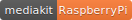

# mediakit

## digitalisation of schools - simple, independent, reliable, economical 

### interactive whiteboard, wireless display, wlan hotspot, fileserver and PC
### All in one for less than 100€:

Website: http://mediakit.education 
Demo: https://youtu.be/1EJf5ur1sM4
 
## Getting Started
- Get a Raspberry Pi 3 B+ with a SD-Card 
- Visit http://mediakit.education/software.php and get a working image file

or  
- Install latest mediakit version in a fresh Raspbian enviroment via github (see installing section)

## Installing
**1.** Install berryboot (https://www.berryterminal.com/doku.php/berryboot) on a fresh sd-card. Once you start your Pi it will start an installer that reformats the SD card and downloads the operating systems files from the Internet. Install the latest Raspbian FULL version suggested by berryboot install process (i.e. Raspbian FULL 2018.11), rename the installed image to Mediakit and set memory split to 256 (see following image)

**2.** Start Raspbian and set WiFi country 

**3.** Open a terminal and clone this github repository: 
> git clone https://github.com/codekoch/mediakit_RaspberryPi

**4.** Change into repository:
>cd mediakit_RaspberryPi

**5.** Run install.sh script:
>./install.sh

**6.** Change current password of user pi (usually **raspberry**) to **mediakitadmin** or to whatever you want.

**7.** Relax and take a coffee. Installation will take a while...

**8.** Reboot

## Hints
- Screenmirroring via miracast works with Android (i.e. SmartView) and Windows devices 
- Guacamole clientless remote desktop is available via http://1.1.1.1:8080 (WLAN) or http://[LAN IP of your pi]:8080 (LAN)
- If a mediakit server is activated, it is available via http://1.1.1.1:3000 (WLAN) or http://[LAN IP of your pi]:3000 (LAN) 
- WLAN password and miracast pin are randomly generated at startup
- All changes done by user mk are deleted at startup

## Recommendation
- With an external wlan dongle wireless display (miracast) and hotspot are activated simultaneously
- Create a copy of the fresh mediakit build with the clone function of berrryboot (see https://www.berryterminal.com/doku.php/berryboot), so that you can allways restore the initial state after some experiments
- Add berryboot mediakit update image (http://images.mediakit.education/actual/Update.img) to activate updates via usb-devices 

## Contributing
Feel free to fork and optimize the code or to pull requests. We think the mediakit project is a good idea and perfect to seriously push the digitalisation of schools with a low budget beside the usual commercial ways. But therefore it needs a strong and active community. Be part of it!

## Authors
Olaf Koch, Simon Zander

## Contact
info@mediakit.education

## License
This project is licensed under the GNU General Public License v3.0 see the [LICENSE](https://github.com/codekoch/mediakit_RaspberryPi/blob/master/LICENSE) file for details

## Credits 
The mediakit project is based on many scripts and external open source software. A few projects should not go unmentioned...
- https://www.berryterminal.com/doku.php/berryboot
- https://github.com/homeworkc/lazycast
- https://github.com/efeiefei/node-file-manager
- https://github.com/flatpak/flatpak
- https://www.raspbian.org/

